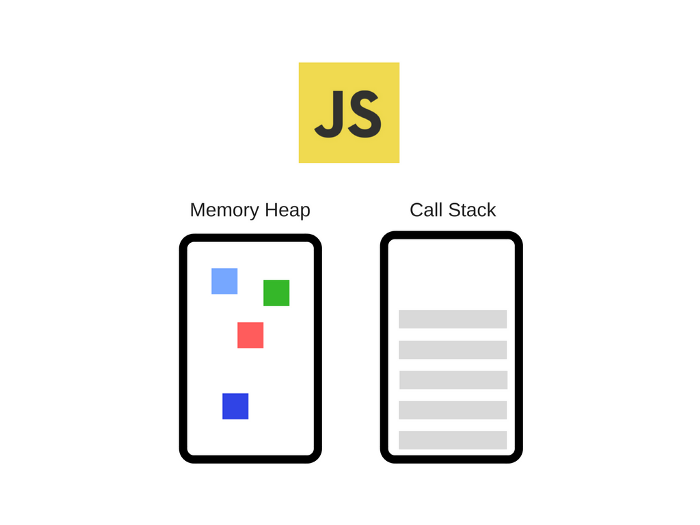

# Javascript under the hood

Let's put things in order. So, we got a glimpse of actual C++ code that runs underneath all the gibberish we write in Node.js, since JavaScript is the highest level component of Node.js, let's start by asking how our code runs, how do JavaScript even work?

Most of people actually knows a few said words and keep repeating them:

- JavaScript is single-threaded
- V8 powers the Chrome JavaScript engine
- JavaScript uses callback queues
- There's an event loop of some sort

But have dug deeper into these questions?

- What does it mean to be single-threaded?
- What in heavens is a JS engine? And what, in fact, is V8?
- How do these callback queues work? Is there only one queue?
- What is an event loop? How does it work? Who provides it? Is it part of JS?

If you're able to answer more than 3 of those, consider yourself above average, because most JavaScript developers in general don't even know there's something at all behind this language... But, fear not, we're here to help, so let's dig deeper into the concept of JavaScript and how it really works and, most important, why other people bully it

## Javascript Engine

Nowadays, the most popular JavaScript engine is V8 (one of the best pieces softwares ever written by mankind, after Git). This is due to the simple fact that the most used browser is Chrome, or is based on Chromium - which is the open source browsing engine of Chrome - like Opera, Brave and so on... However it is not the only one. We have Chakra, written by Microsoft for the Edge browser, and we have SpiderMonkey, written by Netscape which now powers Firefox and much others like Rhino, KJS, Nashorn and etc.

However, since V8 is used both on Chrome and Node.js, we're sticking with it. This is a very simplified view of what it looks like:

This engine consists, mainly, in two components:

- The **memory heap**: where all memory allocation happens
- The **call stack**: where our code gets framed and stacked to execute

## JavaScript Runtime

Most APIs developers use are provided by the engine itself, like we were able to see in the previous chapters when we wrote the `readFile` code. However, some APIs we use are not provided by the engine, like `setTimeout`, any sort of DOM manipulation, like `document` or even AJAX (the `XMLHttpRequest` object). Where are those comming from? Let's take our previous image and bring it into the harsh reality we live in:

The engine is just a tiny bit of what makes JavaScript, well... JavaScript... There are browser-provided APIs which we call **Web APIs**, these APIs (like `DOM`, `AJAX` and `setTimeout`) are provided by the browser vendors - in this case, for Chrome, it's Google - and they are the main reason why most people hated, and still hate, JavaScript. When we look at today's JavaScript we see a field filled with packages and other stuff, but mostly homogeneous on every side. Well... It wasn't always like that.

Back in the day, before ES6 and way before Node.js even existed as an idea, there were no consensus on how to implement these APIs on the browser side, so every vendor had their own implementation of 'em, or not... Which meant that we had to be constantly checking and writing pieces of code that were meant to only work on specific browser (do you remember IE?), so a particular browser could implement the `XMLHttpRequest` a bit different from other browser, or the `setTimeout` function could be named `sleep` in some implementation; in the worst case scenario, the API would not even exist at all. This has been changing gradually, so now, thankfully, we have some consensus and some agreement on which APIs should exist and how they should be implemented, at least the most used and basic ones.

Aside of that, we have the infamous event loop and the callback queue. Which we'll be talking about later.

## Call Stack

Most people have heard that JS is a single-threaded language, and they just accepted it as the final truth in the universe without ever really knowing why. Being single-threaded means we only have a single call stack, in other words, we can only execute one thing at a time.

> The call stack is not a part of Javascript itself, it's a part of its engine, in our case, V8. But I'll put it here so we can have a sense of how things are suposed to work in a flow
> 

### Single-threading pros and cons

Running in a single-thread environment can be very liberating, since it's much simpler than running in a multi-threaded world where we'd have to care about racing conditions and deadlocks. In this world, such things do not exist, after all, we are doing only one thing at once.

However, single-threading can also be very limiting. Since we have a single stack, what would happen if this stacked is blocked by some slow-running code?

[credits]:

- [https://github.com/khaosdoctor/my-notes/blob/master/node/node-under-the-hood.md#what-is-nodejs](https://github.com/khaosdoctor/my-notes/blob/master/node/node-under-the-hood.md#what-is-nodejs)