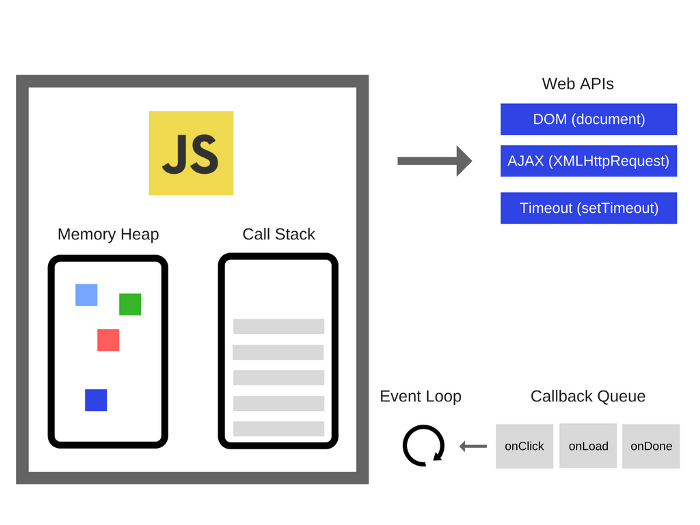

# Libuv & Eventloop

## What is libuv? Why do we need it?

Libuv is an open-source library that handles the thread-pool, doing signaling, inter process communications all other magic needed to make the asynchronous tasks work at all. Libuv was originally developed for Node.js itself as an abstraction around `libev`, however, by now, multiple projects are already using it.

Most people think libuv is the event loop itself, this is not true, libuv implements a full featured event loop, but also is the home of several other key parts of Node, such as:

- TCP and UDP sockets of the `net` package
- Async DNS resolutions
- Async file and file system operations (like the one we're doing here)
- File System events
- IPC
- Child processes and shell control
- Thread pool
- Signal handling
- High resolution clock

This is mainly why Node.js uses it, it's a full abstraction around several key parts of every OS, and it is necessary for the whole runtime to interact with it's surounding environment.

## Event Loop

Let's step aside of the Node.js environment for a while. In the browser, in pure JavaScript, what would happen if you had a long-running function in your call stack? Those sorts of functions that take a while to finish, like a complex image processing or a long matrix transformation?

In most languages you should have no problem, since they are multi-threaded, however, in single-threaded languages, this is a very serious issue. Because while the call stack has functions to execute, the browser can't actually do anything else, and the browser isn't just about HTML and CSS, there are a few other stuff, like a rendering engine that paints the screen to draw whatever you coded in your markup. This means that if you have long running functions, your browser literally halts all execution in that page. That's why most browsers treat tabs as threads or separate processes, so one tab wouldn't freeze all others.

Another issue that might be raised is that browsers are quite controlling big brothers, so if a tab takes to long to respond, they take action by raising an error to ask you whether you want or not to terminate that web page. So... Not the best UX we can have, right? On the other hand, complex tasks and long running code is what allow us to create great software, so how can we perform those without letting our big brother angry? Asynchronous Callbacks, tha base of what Node.js is all about.

## Async callbacks

Most JavaScript applications works by loading a single `.js` file into memory, and then all the magic happens after that single entrypoint is executed. This can be divided into several building blocks, the "now" blocks, and the "later" blocks. Usually, only one of those blocks is going to be a "now" block, which means that it'll be the one to execute in the main thread (pushing calls to the call stack), and all the others will be executed later on.

The biggest problem when it comes to async programming is that most people think that "later" is sometime between "now" and a millisecond after it, which is a lie. Everything in JavaScript which is scheduled to execute and finish at a later time doesn't necessarily happen strictly after the main thread, they're, by definition, going to complete when they complete. Which means you won't have that immediate answer you were looking for.

For instance, let's take a simple AJAX call which call an API:

```node
const response = call('http://api') // call() is some http request package, like fetch
console.log(response)
```

Since AJAX calls do not complete right after they're called - it takes some time for the HTTP handshake to be performed, get the data, download the data... - so this call will be completed in a later state, so the response does not have a value assigned to it yet, which means our `console` function would print `undefined`.

A simple way of "waiting" for the response to come are callbacks. Callbacks are, since the beginning of programming, a automatically called function that is passed on as a parameter to another function which will be executed and/or have its value returned after "now". So, basically, callbacks are a way of saying: "Hey, when you do have this value, call this callback". So let's improve our example:

```node
const response = call('http://api', (response) => {
  console.log(response)
})
```

This is basically stating that when the call is ended, an anonymous function with the `(response) => void` signature will be automatically called, since the call returns the response, this parameter is passed on to the callback. Now we'd have the log on the response.

So in our first code example, the `readFile` call, we're basically transforming it into a Promise, which is a code that will return its value on a later state, and then printing it out, we're reading a file asynchronously. But how does it work at all?

## Inside the event loop

Until ES6, JS actually never had any sort of consensus or notion of asynchrony built into the core itself, this means that JS would receive your order to execute some async code and send it to the engine, which would give JS a thumbs up and answer with "I'll see into it, someday". So there was no order neither logic on how the "later" would behave built into the engines.

JS engines actually do not run isolated from everything. They run inside what is called a *hosting environment*. This environment can be whatever place JS is running into, like a browser, Node.js or, since JS is pretty much everywhere, can be a toaster or a plane. Every environment is different from each other, every one has their own skills and abilities, but they all have an **event loop**.

The event loop is what actually takes care of asynchronous code execution for JS Engines, at least of the scheduling part. It is the one who calls the engine and send the commands to be executed, and also is the one who queues response callbacks which the engine returns to be called afterwards. **So we're beginning to comprehend that a JS Engine is nothing more than an on-demand execution environment for any JS code, working or not.** All that surrounds it, the environment, the event loop, is responsible for scheduling the JS code executions, which are called events.

Now let's go back to our `readFile` code. Whe we run it, the `readFile` function is wrapped into a Promise object, but in essence, the `readFile` function is a callback function. So let's analyse only this part:

```node
fs.readFile(filePath, function cb (err, data) => {
      if (err) return reject(err)
      return resolve(callback(data))
    })
```

See that we have a callback `(err, data) => string`? This is basically telling the engine to run a read operation on a file, the JS Engine then tells the hosting environment that it's going to suspend the execution of that bit of code for now, but, as soon as the environment (the event loop) has the response, it should schedule this anonymous callback function (the `cb`) to be executed as soon as possible. Then, the environment (in our case, it's Node.js) is set up to listen to this response from the file operation, when this response arrives, it schedules the `cb` function to be executed by insertint it into the event loop.

Let's remind of our old diagram:



Web APIs are, in essence, threads that we cannot access as developers, we can only make calls to them. Generally these are pieces that are built into the environment itself, for instance, in a browser environment, these would be APIs like `document`, `XMLHttpRequest` or `setTimeout`, which are mostly async functions. In Node.js these would be our C++ APIs we saw in the first part of the guide.

So, in plain words, whenever we call a function like `setTimeout` on Node.js, this call is sent to a different thread. All of this is controlled and provided by libuv, including the APIs we're using.

Let's zoom into the event loop part:


**The event loop has a single task to do: Monitor the call stack and what is called the *callback queue***. Once the call stack is empty, it'll take the first event from the callback queue and push it into the call stack, which effectively runs it. **To this iteration, taking a callback from the queue and executing it into the call stack, we give the name of `tick`.**

Let's take a simpler example to show how the event loop actually works:

```node
console.log('Node.js')
setTimeout(function cb() { console.log(' awesome!') }, 5000)
console.log(' is')
```

This should print `Node.js is awesome!` in the console, in separated lines. But how do this thing happen? Let's run it step by step:

1. The state is empty, call stack is empty, nothing is called
    
    
    
2. `console.log('Node.js')` is added to the call stack
    
    
    
3. `console.log('Node.js')` is executed
    
    
    
4. `console.log('Node.js')` is removed from the stack
    
    
    
5. `setTimeout(function cb() {...}` is added to the call stack
    
    
    
6. `setTimeout(function cb() {...}` is executed. The environment creates a timer as part of the Web APIs. This timer is going to handle the countdown
    
    
    
7. `setTimeout(function cb() {...}` itself is completed and removed from the call stack
    
    
    
8. `console.log(' is')` is added to the call stack
    
    
    
9. `console.log(' is')` is executed
    
    
    
10. `console.log(' is')` is removed from the call stack
    
    
    
11. After at least 5000 ms, the timer completes and it pushed the `cb` callback function into the callback queue
    
    
    
12. The event loop checks the stack, if it is empty, it'll pop the event loop from the callback queue and pushes into the stack
    
    
    
13. `cb` is executed and adds `console.log(' awesome!')` into the call stack
    
    
    
14. `console.log(' awesome!')` is executed
    
    
    
15. `console.log(' awesome!')` is removed from the stack
    
    
    
16. `cb` is removed from the stack
    
    
    

As we noted earlier, the ES6 specifies how the event loop should behave, so now, technically, it's within the scope of the JS Engine's responsibilities to take care of that scheduling, which is no longer playing the role of only a hosting environment. The main reason why this happened is because of the introduction of the native Promises in ES6, which - as we'll see later on - needed to take some fine-grained control over scheduling operations and queues.

## Later does not necessarily means "later"

One thing that is important to notice in the above code is that `setTimeout` will **not** automatically put your callback on the event loop queue after it's done. `setTimeout` is an web API whose only job is to set a timer to execute some other function later. After the timer expires, the **environment** puts your callback into the event loop callback queue, so that some future tick will pick it up and launch it into the call stack.

So when we do `setTimeout(cb, 1000)` we expect our `cb` function to be called after 1000 ms, right? Yeah, but that is not what actually happens unde the hood. This is only saying: "Hey! I've noted your request, so when 1000ms pass I'll place your `cb` function on the queue", but remember, queues have a different order than stacks, so callbacks will be added to the end of the queue, which means that the queue might have other events that were added earlier - so your callback will have to wait the completion of them all in order to be processed. One of the best examples to show how this async madness work is to set a timeout function to 0. Naturally you hope this function to be executed soon after you've added it to the code, right? Wrong.

```node
console.log('Node.js')
setTimeout(() => console.log('is'), 0)
console.log('Awesome!')
```

Our first thought is: "The printed code will be `Node.js is Awesome!` in three lines", but this is not what happens. Setting a timeout to 0 only defers its callback execution to the next moment when the call stack is clear. In fact, our response would be a Yoda-like phrase:

```bash
Node.js
Awesome!
is
```

## Microtasks and Macrotasks

This is why ES6 was so important to async executions in JS, it standardized everything we knew about async so they'd all function the same way, and also added another concept called "**Microtask Queue**" - or "**Job Queue**". It's a layer on top of the callback queue - which will now be called "**Macrotask Queue**" - that you'll most likely bump into when working with Promises.

To be very specific and short. The Microtask Queue is a queue that is attached to the end of every tick in the Event Loop. So certain async actions that occur during a tick of the event loop, will not cause a new callback to be added in the Macrotask Queue, but instead, will add an item - which is called "Microtask" or "Job" - to the end of the current tick's Microtask queue. This means that, now, you can be assured that you can add functionality to be executed later in the Microtask queue and it'll be executed right after your tick, before anything from the Macrotask Queue comes up.

Since there are no restrictions of what a Microtask can do to your code, it's possible for a Microtask to add another Microtask in the end of the same queue endlessly, causing what is called a "Microtask loop", which starves the program of the needed resources and prevent it from moving on the the next tick. This is the equivalent of having a `while(true)` loop running in your code, but asynchronously.

In order to prevent such starvation, the engine has built-in protection called `process.maxTickDepth`, which is set to the value of 1000, after 1000 microtasks have been scheduled and ran in the same tick, then the next macrotask is run.

> `setTimeout(cb, 0)` was a "workaround" to add callbacks that were sure to be added right after the execution on the queue, much like Microtasks do, however, Microtasks are a much more clean and defined specification of ordering, meaning things will execute later, but ASAP.
> 

According to the [WHATVG](https://html.spec.whatwg.org/multipage/webappapis.html#task-queue) specification, one, and exactly one, macrotask should be processed from the macrotask queue in one tick of the event loop. After this macrotask has finished, all other available microtasks should be processed within the same tick. Since microtasks can queue other microtasks, while there are microtasks in the microtask queue, they should all be run one by one until the microtask queue is empty. As shows this diagram:


Not all tasks are microtasks, these are some examples of microtasks:

- `process.nextTick`
- Promises
- `Object.observe`

These are macrotasks:

- `setTimeout`
- `setInterval`
- `setImmediate`
- any I/O operation

Let's take this code as an example:

```node
console.log('script start')

const interval = setInterval(() => {
  console.log('setInterval')
}, 0)

setTimeout(() => {
  console.log('setTimeout 1')

  Promise.resolve()
    .then(() => console.log('promise 3'))
    .then(() => console.log('promise 4'))
    .then(() => {
      setTimeout(() => {
        console.log('setTimeout 2')
        Promise.resolve().then(() => console.log('promise 5'))
          .then(() => console.log('promise 6'))
          .then(() => clearInterval(interval))
      }, 0)
    })
}, 0)

Promise.resolve()
  .then(() => console.log('promise 1'))
  .then(() => console.log('promise 2'))
```

This will log:

```bash
script start
promise 1
promise 2
setInterval
setTimeout 1
promise 3
promise 4
setInterval
setTimeout 2
promise 5
promise 6
```

If we go through this step by step we'll have something like this:

**First tick**

- The first `console.log` will be stacked onto the call stack and executed, then it'll be poped out
- `setInterval` is scheduled as a task
- `setTimeout 1` is scheduled as a task
- both "then's" of `Promise.resolve 1` are scheduled as microtasks
- Since the stack is empty, microtasks are run
    - The call stack stacks and pops two `console.log` expressions
    - "promise 1" and "promise 2" are printed

> Our macrotask queue has: [setInterval, setTimeout 1]
> 

**Second Tick**

- The microtask queue is empty, the `setInterval` handler can be run.
    - Call stack runs and pops `console.log` expression
    - "setInterval" is printed
    - Schedules another `setInterval` after `setTimeout 1`

> Our macrotask queue has: [setTimeout 1, setInterval]
> 

**Thrid Tick**

- The microtask queue remains empty
- `setTimeout 1` handler is run
    - Call stack runs and pops `console.log` expression
        - "setTimeout 1" is printed
    - "Promise 3" and "Promise 4" handlers are scheduled as microtasks
    - Both handlers of Promises 3 and 4 are run
        - Call stack runs and pops two `console.log` expressions
        - Prints "promise 3" and "promise 4"
    - The next handler for promise 3 and 4 schedules a `setTimeout 2` task

> Our macrotask queue has: [setInterval, setTimeout 2]
> 

**Forth Tick**

- Microtask queue is empty, `setInterval` handler is run, which enqueues another `setInterval` right behind `setTimeout`

> Our macrotask queue has: [setTimeout 2, setInterval]
> 
- `setTimeout 2` handler is run
    - Promise 5 and 6 are schedule as microtasks
    - Handlers for promises 5 and 6 are run
        - Call stack receives two more `console.log` calls
        - Prints "promise 5" and "promise 6"
        - Clears interval

> Our macrotask queue has: []
> 

This is why it's important to note how things work under the hood, otherwise we'd never know Promises execute faster than callbacks!!

## Conclusion


- While V8 inside Node is executing the code synchronously, the I/O and other asynchronous work is handled and done by OS through the libuv module of Node, where libuv have an Event Loop where it constantly keep an eye on I/O tasks (filesystem, network I/o etc), make requests to OS, and when OS is done it triggers an event inside the queue of libuv, which is then processed by libuv, and callback is triggered by libuv (according to event loop scheduling mechanism which we would explore in later modules) to v8 when the call stack of V8 is empty.
- This whole process is termed as **Event Driven Non-Blocking I/O.**
- **Note:** While the V8 is doing the work synchronously, it is **Node** which is executing this whole process, ie., the V8 and the libuv **Asynchronously** within C++.

[credits]:

- [https://github.com/khaosdoctor/my-notes/blob/master/node/node-under-the-hood.md#what-is-nodejs](https://github.com/khaosdoctor/my-notes/blob/master/node/node-under-the-hood.md#what-is-nodejs)