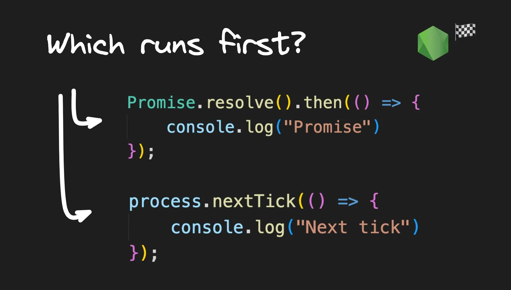
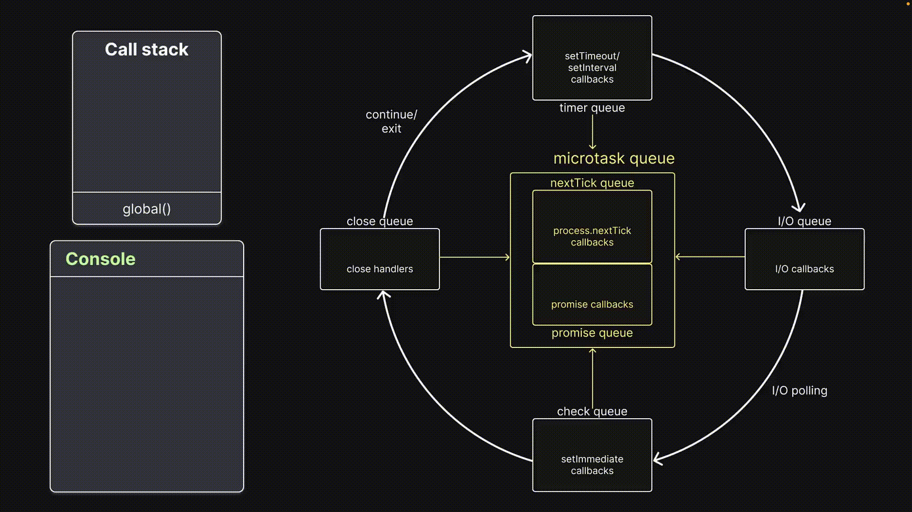

# Visualizing `nextTick` and Promise Queues in Node.js Event Loop



## **Enqueueing callback functions**

To enqueue a callback function in the `nextTick` queue, we use the built-in `[process.nextTick()](https://nodejs.dev/en/learn/understanding-processnexttick/)` method. The syntax is straightforward: `process.nextTick(callbackFn)`. When this method is executed on the call stack, the callback function will be enqueued in the `nextTick` queue.

To enqueue a callback function in the promise queue, we'll be using `Promise.resolve().then(callbackFn)` . When the promise resolves, the function passed into the `then()` block will be queued up in the promise queue.

Now that we understand how to add callback functions to both the queues, let's start with our first experiment.

## **Experiment 1**

### **Code**

```node
// index.js
console.log("console.log 1");
process.nextTick(() => console.log("this is process.nextTick 1"));
console.log("console.log 2");
```

Here, we have a minimal piece of code that logs three different statements. The second statement makes use of the `process.nextTick()` method to enqueue a callback function in the `nextTick` queue.

### Visualization

!

The first `console.log()` statement is executed by being pushed onto the call stack. It logs the corresponding message in the console and is then popped off the stack.

Next, `process.nextTick()` is executed on the call stack. This queues up the callback function into the nextTick queue and is popped off. Since there is still user-written code to execute, the callback function has to wait for its turn.

Execution moves on and the last `console.log()` statement is pushed onto the stack. The message is logged to the console and the function is popped off the stack. Now, there is no more user-written synchronous code to execute, so control enters the event loop.

The callback function from the nextTick queue is pushed onto the stack, `console.log()` is pushed onto the stack, executed, and the corresponding message is logged to the console.

### ****Inference****

> **All user-written synchronous JavaScript code takes priority over async code that the runtime would like to eventually execute.**
> 

Let’s move on to the second experiment.

## **Experiment 2**

### **Code**

```node
// index.js
Promise.resolve().then(() => console.log("this is Promise.resolve 1"));
process.nextTick(() => console.log("this is process.nextTick 1"));
```

We have one call to `Promise.resolve().then()` and one call to `process.nextTick()`.

### Visualization


When the call stack executes line 1, it queues the callback function in the `Promise` queue.

When the call stack executes line 2, it queues the callback function in the `nextTick` queue.

There is no more user-written code to execute after line 2.

Control enters the event loop, where the `nextTick` queue gets priority over the promise queue (it’s how the Node.js runtime works).

The event loop executes the `nextTick` queue callback function and then the promise queue callback function.

The console shows `"this is process.nextTick 1"`, and then `"this is Promise.resolve 1"`.

### **Inference**

> **All callbacks in the `nextTick` queue are executed before callbacks in the promise queue.**
> 

Let me walk you through a more elaborate version of the above second experiment.

## **Bonus experiment**

### **Code**

```node
// index.js
process.nextTick(() => console.log("this is process.nextTick 1"));
process.nextTick(() => {
  console.log("this is process.nextTick 2");
  process.nextTick(() =>
    console.log("this is the inner next tick inside next tick")
  );
});
process.nextTick(() => console.log("this is process.nextTick 3"));

Promise.resolve().then(() => console.log("this is Promise.resolve 1"));
Promise.resolve().then(() => {
  console.log("this is Promise.resolve 2");
  process.nextTick(() =>
    console.log("this is the inner next tick inside Promise then block")
  );
});
Promise.resolve().then(() => console.log("this is Promise.resolve 3"));
```

The code contains three calls to `process.nextTick()` and three calls to `Promise.resolve()` statements. Each callback function logs an appropriate message.

However, the second `process.nextTick()`, and the second `Promise.resolve()` have an additional `process.nextTick()` statement, each with a callback function.

### Visualization


To speed up the explanation for this visualization, I will omit the call stack. When the call stack executes all six statements, there are three callbacks in the `nextTick` queue and three in the promise queue. With nothing left to execute, control enters the event loop.

As we know, the `nextTick` queue gets priority. The first callback is executed, and the corresponding message is logged to the console.

Next, the second callback function is executed, which logs the second log statement. However, this callback function contains another call to `process.nextTick()`, which queues up the inner log statement at the end of the `nextTick` queue.

Node then executes the third `nextTick` callback logging the corresponding message to the console. Initially, there were only three callbacks, but the second callback added another callback to the queue which now gets its turn.

The event loop pushes the inner `nextTick` callback, and the `console.log()` statement is executed.

The `nextTick` queue is empty, and control proceeds to the promise queue. The promise queue is similar to the `nextTick` queue.

First, `“Promise.resolve 1”` is logged, followed by `“Promise.resolve 2”`. However, a function is added to the `nextTick` queue with a call to `process.nextTick()`. Despite this, control remains in the promise queue and continues executing other callback functions. We then get `Promise.resolve 3`, and at this point, the promise queue is empty.

Node will once again check if there are new callbacks in the microtask queues. Since there is one in the `nextTick` queue, it executes that, which results in our last log statement.

This may be a slightly advanced experiment, but the inference remains the same.

### **Inference**

> **All callbacks in the `nextTick` queue are executed before all callbacks in promise queue.**
> 

Be cautious when using `process.nextTick()`. Overuse of this method can cause the event loop to become starved, preventing the rest of the queue from running. Even with a large number of `nextTick()` calls, the I/O queue can be prevented from executing its own callbacks. The official docs suggest using `process.nextTick()` for two main reasons: to handle errors or to allow a callback to run after the call stack has unwound but before the event loop continues. When using `process.nextTick()`, make sure to use it judiciously.

[credits]:

- [https://www.builder.io/blog/NodeJS-visualizing-nextTick-and-promise-queues](https://www.builder.io/blog/NodeJS-visualizing-nextTick-and-promise-queues)