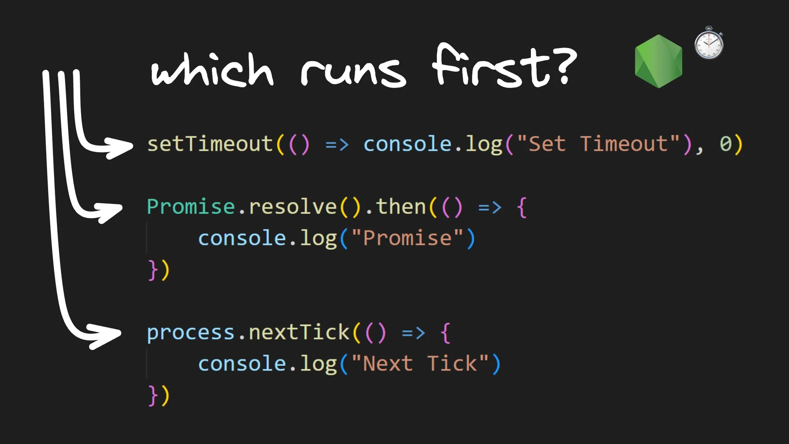

# Visualizing The Timer Queue in Node.js Event Loop



## **Enqueueing callback functions**

Now let's move on to the Timer Queue. To queue a callback function into the Timer Queue, we can use functions such as `setTimeout` and `setInterval`. For the purpose of this blog post, we will be using `setTimeout`.

To understand the order of execution in the Timer Queue, let's conduct a series of experiments. We will queue up tasks in both the Microtask Queue and the Timer Queue.

## **Experiment 3**

## **Code**

```node
// index.js
setTimeout(() => console.log("this is setTimeout 1"), 0);
setTimeout(() => console.log("this is setTimeout 2"), 0);
setTimeout(() => console.log("this is setTimeout 3"), 0);

process.nextTick(() => console.log("this is process.nextTick 1"));
process.nextTick(() => {
  console.log("this is process.nextTick 2");
  process.nextTick(() =>
    console.log("this is the inner next tick inside next tick")
  );
});
process.nextTick(() => console.log("this is process.nextTick 3"));

Promise.resolve().then(() => console.log("this is Promise.resolve 1"));
Promise.resolve().then(() => {
  console.log("this is Promise.resolve 2");
  process.nextTick(() =>
    console.log("this is the inner next tick inside Promise then block")
  );
});
Promise.resolve().then(() => console.log("this is Promise.resolve 3"));
```

The code contains three calls to `process.nextTick()` and three calls to `Promise.resolve()` and three calls to `setTimeout`. Each callback function logs an appropriate message. All three `setTimeout` calls have a delay of `0ms`, which means that the callback functions are queued up as soon as each `setTimeout` statement is executed on the call stack. The second `process.nextTick()`, and the second `Promise.resolve()` have an additional `process.nextTick()` statement, each with a callback function.

### Visualization


When the call stack executes all statements, we end up with three callbacks in the nextTick queue, three in the Promise queue, and three in the Timer Queue. There is no further code to execute, and control enters the event loop.

The nextTick queue has the highest priority, followed by the Promise queue, and then the Timer Queue. The first callback from the nextTick queue is dequeued and executed, logging a message to the console. Then, the second callback is dequeued and executed, which also logs a message. The second callback includes a call to `process.nextTick()`, which adds a new callback to the nextTick queue. Execution continues, and the third callback is dequeued and executed, logging a message as well. Finally, the newly added callback is dequeued and executed on the call stack, resulting in the fourth log message in the console.

After the nextTick queue is empty, the event loop proceeds to the Promise queue. The first callback is dequeued and executed on the call stack, printing a message in the console. The second callback has a similar effect and also adds a callback to the nextTick queue. The third callback in the Promise is executed, resulting in the next log message. At this point, the Promise queue is empty, and the event loop checks the nextTick queue for new callbacks. It finds one, which is also executed by logging a message to the console.

Now, both Microtask Queues are empty, and the event loop moves on to the Timer Queue. We have three callbacks, and each of them is dequeued and executed on the call stack one by one. This will print `"setTimeout 1"` , `"setTimeout 2"`, and `"setTimeout 3"`.

### **Inference**

> **Callbacks in the Microtask Queues are executed before callbacks in the Timer Queue.**
> 

Alright, so far, the order of priority is the nextTick queue, followed by the Promise queue, and then the timer queue. Let's now proceed to the next experiment.

## **Experiment 4**

### **Code**

```node
// index.js
setTimeout(() => console.log("this is setTimeout 1"), 0);
setTimeout(() => {
  console.log("this is setTimeout 2");
  process.nextTick(() =>
    console.log("this is inner nextTick inside setTimeout")
  );
}, 0);
setTimeout(() => console.log("this is setTimeout 3"), 0);

process.nextTick(() => console.log("this is process.nextTick 1"));
process.nextTick(() => {
  console.log("this is process.nextTick 2");
  process.nextTick(() =>
    console.log("this is the inner next tick inside next tick")
  );
});
process.nextTick(() => console.log("this is process.nextTick 3"));

Promise.resolve().then(() => console.log("this is Promise.resolve 1"));
Promise.resolve().then(() => {
  console.log("this is Promise.resolve 2");
  process.nextTick(() =>
    console.log("this is the inner next tick inside Promise then block")
  );
});
Promise.resolve().then(() => console.log("this is Promise.resolve 3"));
```

The code for the fourth experiment will be mostly the same as that of the third, with one exception. The callback function passed to the second `setTimeout` function now includes a call to `process.nextTick()`.

### Visualization


Let's apply what we learned from the previous experiment and fast forward to the point where callbacks in the microtask queues have already been executed. Assume we have three callbacks queued up in the timer queue. The first callback is dequeued and executed on the call stack, resulting in a `"setTimeout 1"` message being printed to the console. The event loop proceeds and runs the second callback as well, resulting in a `"setTimeout 2"` message being printed to the console. However, this also queues up a callback function in the nextTick queue.

After executing each callback in the timer queue, the event loop goes back and checks the microtask queues. It checks the nextTick queue and identifies a callback that needs to be executed. This callback is dequeued and executed on the call stack, resulting in the `"inner nextTick"` message being printed to the console.

Now that the microtask queues are empty, the control goes back to the timer queue, and the last callback is executed resulting in a "setTimeout 3" message in the console.

### **Inference**

> **Callbacks in microtask queues are executed in between the execution of callbacks in the timer queue**
> 

## **Experiment 5**

### **Code**

```node
// index.js
setTimeout(() => console.log("this is setTimeout 1"), 1000);
setTimeout(() => console.log("this is setTimeout 2"), 500);
setTimeout(() => console.log("this is setTimeout 3"), 0);
```

The code contains three `setTimeout` statements that queue up three different callback functions. The first `setTimeout` has a delay of 1000ms, the second has a delay of 500ms, and the third has a delay of 0ms. The callback functions simply log a message to the console when they are executed.

### Visualization

We will skip visualization for this experiment since the execution of the code snippet is quite simple. When multiple `setTimeout` calls are made, the event loop queues up the one with the shortest delay first and executes it before the others. As a result, we observe `“setTimeout 3”` executing first, followed by `“setTimeout 2”`, and then `“setTimeout 1”`.

### **Inference**

> **Timer queue callbacks are executed in a first-in, first-out (FIFO) order.**
> 

## Conclusion

The experiments show that callbacks in the Microtask Queue have a higher priority than those in the Timer Queue, and callbacks in the Microtask Queue are executed in between the execution of callbacks in the Timer Queue. The Timer Queue follows a first-in, first-out (FIFO) order.

[credits]: 

- [https://www.builder.io/blog/visualizing-nodejs-timer-queue](https://www.builder.io/blog/visualizing-nodejs-timer-queue)