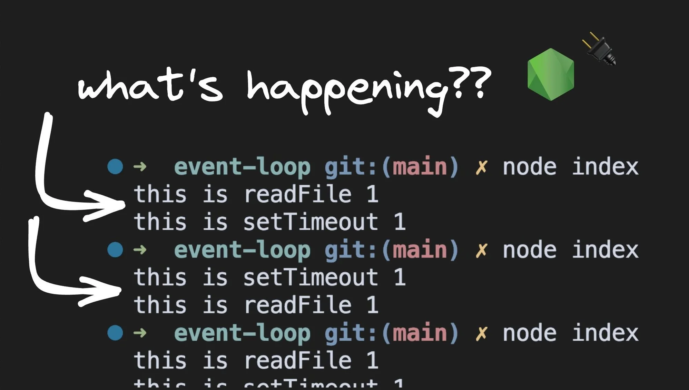
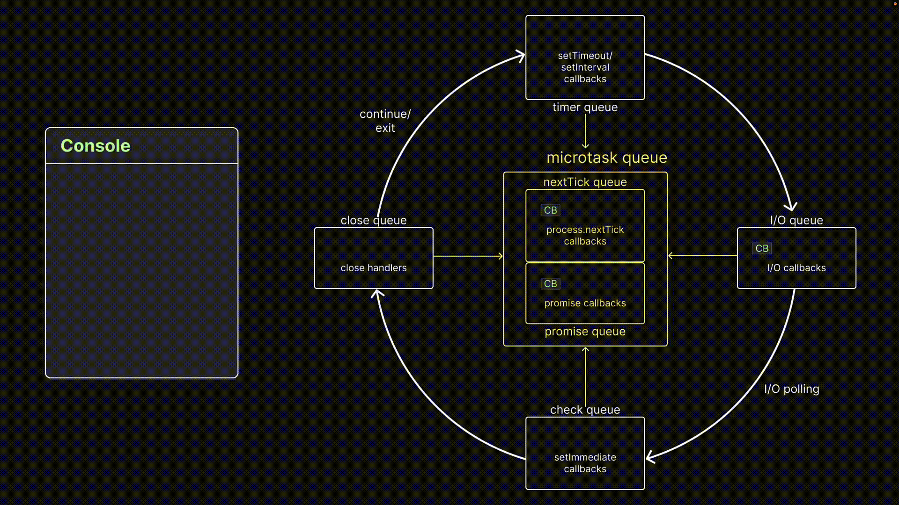
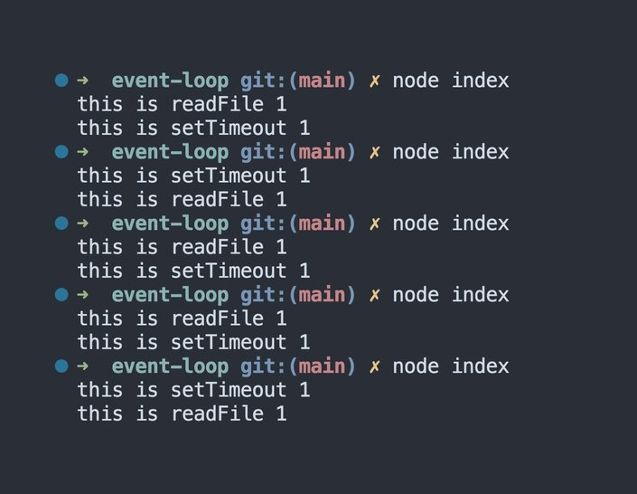

# Visualizing the I/O Queue in the Node.js Event Loop



## **Enqueueing callback functions**

To add a callback function to the I/O queue, we can use most of the async methods from the built-in Node.js modules. For our experiments, we will be using the `readFile()` method from the `fs` module.

## **Experiment 6**

### **Code**

```node
// index.js
const fs = require("fs");

fs.readFile(__filename, () => {
  console.log("this is readFile 1");
});

process.nextTick(() => console.log("this is process.nextTick 1"));
Promise.resolve().then(() => console.log("this is Promise.resolve 1"));
```

First, we import the `fs` module and call its `readFile()` method. This adds a callback function to the Input/Output queue. After `readFile()`, we add a callback function to the `nextTick` queue and a callback function to the promise queue.

### Visualization



After executing all statements in the call stack, there is one callback each in the nextTick queue, promise queue, and I/O queue. Since there is no further code to execute, control enters the event loop.

The `nextTick` queue has top priority, followed by the promise queue and then the I/O queue. The first callback in the nextTick queue is dequeued and executed, logging a message to the console.

With the `nextTick` queue empty, the event loop proceeds to the promise queue. The callback is dequeued and executed on the call stack, printing a message to the console.

Since the promise queue is now empty, the event loop proceeds to the timer queue. With no callbacks in the timer queue, the event loop proceeds to the I/O queue, which has one callback. This callback is dequeued and executed, resulting in the final log message on the console.

### **Inference**

> **Callbacks in the microtask queue are executed before callbacks in the I/O queue.**
> 

For our next experiment, let’s swap the Microtask queue with the Timer queue.

## **Experiment 7**

### **Code**

```node
// index.js
const fs = require("fs");

setTimeout(() => console.log("this is setTimeout 1"), 0);

fs.readFile(__filename, () => {
  console.log("this is readFile 1");
});
```

The code involves queuing up the timer queue using a `setTimeout()` with a 0-second delay, instead of queuing up the Microtask queue.

### **Visualization**

At first glance, the expected output seems straightforward: the `setTimeout()` callback is executed before the `readFile()` callback. However, it's not so simple. Here's the output from running the same piece of code five times.



This inconsistency in output occurs due to the unpredictability of the order of execution when using `setTimeout()` with a delay of 0 milliseconds and an I/O asynchronous method. The obvious question that arises is, "Why can't the order of execution be guaranteed?"

The anomaly is due to how a minimum delay is set for timers. In [the C++ code for the DOMTimer](https://chromium.googlesource.com/chromium/blink/+/master/Source/core/frame/DOMTimer.cpp#93), we come across a very interesting piece of code. The interval in milliseconds is calculated, but the calculation is capped at a maximum of 1 millisecond or the user-passed interval multiplied by 1 millisecond.

This means that if we pass in 0 milliseconds, the interval is set to max(1,0), which is 1. This will result in setTimeout with a 1 millisecond delay. It seems that Node.js follows a similar implementation. When you set a 0 millisecond delay, it is overwritten to a 1 millisecond delay.

But how does a 1ms delay affect the order of the two log statements?


At the start of the event loop, Node.js needs to determine if the 1ms timer has elapsed or not. If the event loop enters the timer queue at 0.05ms and the 1ms callback hasn't been queued, control moves on to the I/O queue, executing the `readFile()` callback. In the next iteration of the event loop, the timer queue callback will be executed.


On the other hand, if the CPU is busy and enters the timer queue at 1.01 ms, the timer will have elapsed and the callback function will be executed. Control will then proceed to the I/O queue, and the `readFile()` callback will be executed.

Due to the uncertainty of how busy the CPU can be and the 0ms delay being overwritten as 1ms delay, we can never guarantee the order of execution between a 0ms timer and an I/O callback.

### **Inference**

> **When running `setTimeout()` with a delay of 0ms and an I/O async method, the order of execution can never be guaranteed.**
> 

Next, let's review the order of execution for callbacks in the Microtask queue, Timer queue, and I/O queue.

## **Experiment 8**

### **Code**

```node
// index.js
const fs = require("fs");

fs.readFile(__filename, () => {
  console.log("this is readFile 1");
});

process.nextTick(() => console.log("this is process.nextTick 1"));
Promise.resolve().then(() => console.log("this is Promise.resolve 1"));
setTimeout(() => console.log("this is setTimeout 1"), 0);

for (let i = 0; i < 2000000000; i++) {}
```

The code includes several calls that queue up a callback function in different queues. The `readFile()` call queues up the callback function in the I/O queue, the `process.nextTick()` call queues it up in the nextTick queue, the `Promise.resolve().then()` call queues it up in the promise queue, and the `setTimeout()` call queues it up in the timer queue.

To avoid any timer issues from the previous experiment, we add a for loop that does nothing. This ensures that when control enters the timer queue, the `setTimeout()` timer has already elapsed, and the callback is ready to be executed.

### Visualization


To visualize the order of execution, let's break down what's happening in the code. When the call stack executes all statements, we end up with one callback in the `nextTick` queue, one in the promise queue, one in the timer queue, and one in the I/O queue.

With no further code to execute, control enters the event loop. The first callback from the `nextTick` queue is dequeued and executed, logging a message to the console. With the nextTick queue now empty, the event loop proceeds to the Promise queue. The callback is dequeued and executed on the call stack, printing a message in the console.

At this point, the Promise queue is empty, and the event loop proceeds to the timer queue. The callback function is dequeued and executed. Finally, the event loop proceeds to the I/O queue, where we have one callback that is dequeued and executed, resulting in the final log message in the console.

### **Inference**

> **I/O queue callbacks are executed after Microtask queues callbacks and Timer queue callbacks.**
> 

## **Conclusion**

The experiments show that callbacks in the Input/Output Queue are executed after callbacks in the Microtask queue and callbacks in the Timer queue. When running setTimeout() with a 0 millisecond delay and an I/O async method, the order of execution depends on how busy the CPU is.

[credits]: 

- [https://www.builder.io/blog/visualizing-nodejs-io-queue](https://www.builder.io/blog/visualizing-nodejs-io-queue)