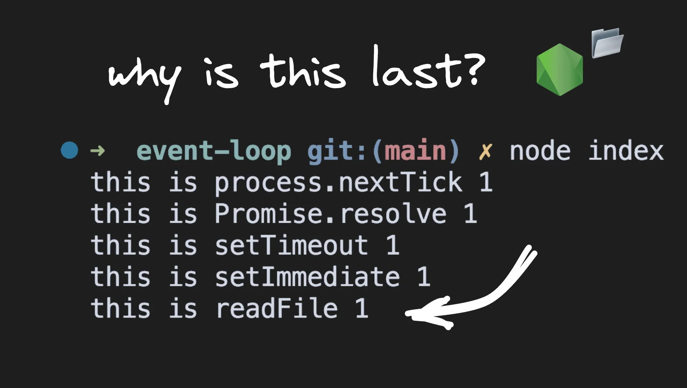
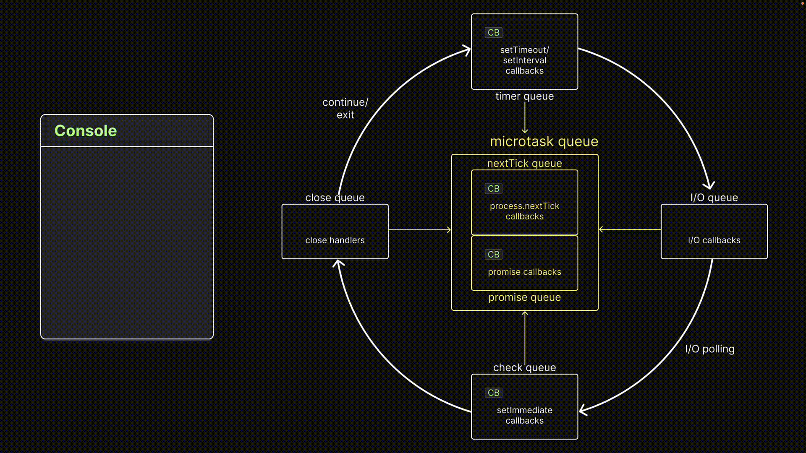

# Visualizing I/O Polling in the Node.js Event Loop



## **Enqueueing callback functions**

Before we proceed with the experiment, I want to mention that to enqueue a callback function in the check queue, we use the built-in `setImmediate()` function. The syntax is straightforward: `setImmediate(callbackFn)`. When this function is executed on the call stack, the callback function will be enqueued in the check queue.

## **Experiment 9**

### **Code**

```node
// index.js
const fs = require("fs");

fs.readFile(__filename, () => {
  console.log("this is readFile 1");
});

process.nextTick(() => console.log("this is process.nextTick 1"));
Promise.resolve().then(() => console.log("this is Promise.resolve 1"));
setTimeout(() => console.log("this is setTimeout 1"), 0);
setImmediate(() => console.log("this is setImmediate 1"));

for (let i = 0; i < 2000000000; i++) {}
```

The code snippet continues from the previous experiment. It includes a call to `readFile()`, which queues up the callback function in the I/O queue, a call to `process.nextTick()`, which queues up the callback function in the `nextTick` queue, a call to `Promise.resolve().then()`, which queues up the callback function in the promise queue, and a call to `setTimeout()`, which queues up the callback function in the timer queue.

The `setImmediate()` call, introduced in this experiment, queues up the callback function in the check queue. To avoid the timer issue from experiment 7, a long-running `for` loop ensures that when control enters the timer queue, the `setTimeout()` timer has elapsed and the callback is ready to be executed.

### Visualization

If you run the code snippet, you may notice that the output is not what you expected. The callback message from `setImmediate()` is logged before the callback message from `readFile()` . Here is the output for reference.


This may seem odd, as the I/O queue appears before the check queue, but it makes sense once we understand the concept of I/O polling that occurs between the two queues. To help illustrate this concept, let me provide a visualization.



First, all functions are executed on the call stack, resulting in callbacks being queued up in the appropriate queues. However, the `readFile()` callback is not queued up at the same time. Let me explain why.

When the control enters the event loop, the microtask queues are checked first for callbacks. In this case, there is one callback in each of the nextTick queue and the promise queue. The nextTick queue has priority, so we see `"nextTick 1"` logged first, followed by `"Promise 1"`.

Both queues are empty, and control moves to the timer queue. There is one callback, which logs "setTimeout 1" to the console.

Now comes the interesting part. When the control reaches the I/O queue, we expect the `readFile()` callback to be present, right? After all, we have a long-running `for` loop, and `readFile()` should have completed by now.

However, in reality, the event loop has to poll to check if I/O operations are complete, and it only queues up completed operation callbacks. This means that when the control enters the I/O queue for the first time, the queue is still empty.

The control then proceeds to the polling part of the event loop, where it checks with `readFile()` if the task has been completed. `readFile()` confirms that it has, and the event loop now adds the associated callback function to the I/O queue. However, the execution has already moved past the I/O queue, and the callback has to wait for its turn to be executed.

The control then proceeds to the check queue, where it finds one callback. It logs `"setImmediate 1"` to the console and then starts a new iteration because there is nothing else left to process in the current iteration of the event loop.

It appears that the microtask and timer queues are empty, but there is a callback in the I/O queue. The callback is executed, and `"readFile 1"` is finally logged to the console.

This is why we see `"setImmediate 1"` logged before `"readFile 1"`. This behavior actually occurred in our previous experiment as well, but we didn't have any further code to run, so we didn't observe it.

### **Inference**

> **I/O events are polled and callback functions are added to the I/O queue only after the I/O is complete**
> 

## **Conclusion**

Once an I/O operation completes, its callback function is not immediately queued into the I/O queue. Instead, an I/O polling phase checks for the completion of I/O operations and queues up the callbacks for completed operations. This can sometimes result in check queue callbacks being executed before I/O queue callbacks.

However, when both queues contain callback functions, the callbacks in the I/O queue always take priority and run first. It is crucial to understand this behaviour when designing systems that rely on I/O callbacks to ensure the proper ordering and execution of callbacks.

[credits]: 

- [https://www.builder.io/blog/visualizing-nodejs-io-polling](https://www.builder.io/blog/visualizing-nodejs-io-polling)