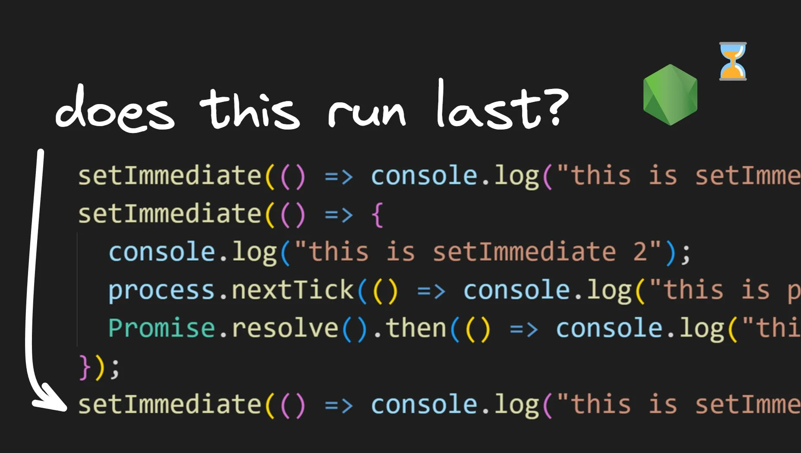
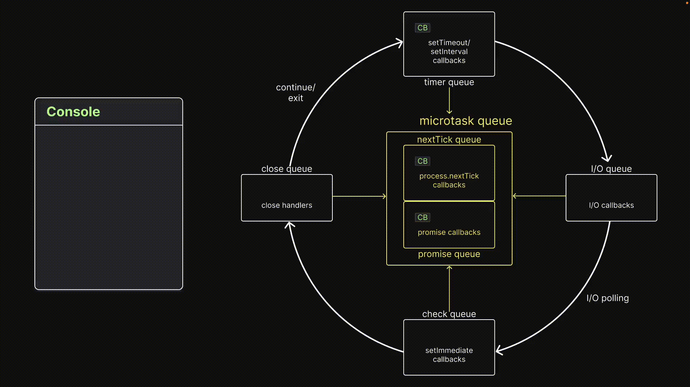
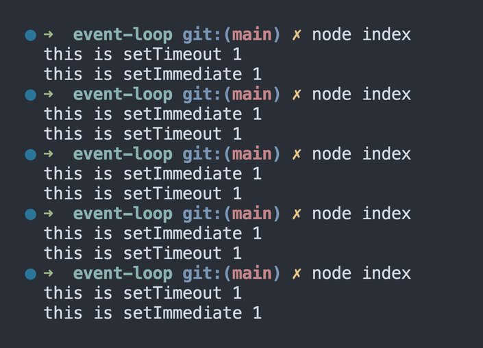

# Visualizing the Check Queue in the Node.js Event Loop



## **Experiment 10**

### **Code**

```node
// index.js
const fs = require("fs");

fs.readFile(__filename, () => {
  console.log("this is readFile 1");
  setImmediate(() => console.log("this is setImmediate 1"));
});

process.nextTick(() => console.log("this is process.nextTick 1"));
Promise.resolve().then(() => console.log("this is Promise.resolve 1"));
setTimeout(() => console.log("this is setTimeout 1"), 0);

for (let i = 0; i < 2000000000; i++) {}
```

The code snippet continues from the previous experiment. It includes a call to `readFile()`, which queues up the callback function in the I/O queue. Additionally, there is a call to `process.nextTick()`, which queues up the callback function in the nextTick queue, a call to `Promise.resolve().then()`, which queues up the callback function in the promise queue, and a call to `setTimeout()`, which queues up the callback function in the timer queue.

The difference from the previous experiment is the execution of the `setImmediate()` statement. Instead of being executed at the end, it is now executed within the `readFile()` callback. This is to ensure that the `setImmediate()` callback is queued only after the I/O polling is complete.

### Visualization



After executing all the statements on the call stack, we end up with one callback in the `nextTick` queue, another in the promise queue, and one in the timer queue. There is no callback in the I/O queue yet because I/O polling has not yet been completed, as we learned in the previous article.

When there is no further code to execute, control enters the event loop. The first callback from the `nextTick` queue is dequeued and executed, logging a message to the console. With the `nextTick` queue empty, the event loop moves on to the promise queue. The callback is dequeued and executed on the call stack, logging a message in the console.

At this point, the promise queue is empty, and the event loop proceeds to the timer queue. There is one callback in the timer queue that is dequeued and executed, resulting in the third log message in the console.

Now, the event loop proceeds to the I/O queue, but at this point, this queue does not have any callbacks. It then proceeds to the I/O polling phase. During this phase, the callback function from the completed `readFile()` operation is pushed into the I/O queue.

The event loop then proceeds to the check queue and the close queue, both of which are empty. The loop proceeds to the second iteration. It checks the `nextTick` queue, promise queue, timer queue, and finally arrives at the I/O queue.

Here, it encounters a new callback function which is executed, resulting in the fourth message being logged to the console. This callback also includes a call to `setImmediate()`, which queues up another callback function in the check queue.

Finally, the event loop proceeds to the check queue, dequeues the callback function, and executes it, resulting in the last message being printed in the console. Hopefully, this visualization makes sense.

### **Inference**

> **Check queue callbacks are executed after microtask queues callbacks, timer queue callbacks and I/O queue callbacks are executed.**
> 

Let's proceed to the next experiment to gain a better understanding of the order of priority for microtask queues and check queue.

## **Experiment 11**

### **Code**

```node
// index.js
const fs = require("fs");

fs.readFile(__filename, () => {
  console.log("this is readFile 1");
  setImmediate(() => console.log("this is setImmediate 1"));
	process.nextTick(() =>
	  console.log("this is inner process.nextTick inside readFile")
	);
	Promise.resolve().then(() =>
	  console.log("this is inner Promise.resolve inside readFile")
	);
});

process.nextTick(() => console.log("this is process.nextTick 1"));
Promise.resolve().then(() => console.log("this is Promise.resolve 1"));
setTimeout(() => console.log("this is setTimeout 1"), 0);

for (let i = 0; i < 2000000000; i++) {}
```

### Visualization


After execution of all statements in the call stack, there will be one callback in each of the `nextTick`, promise, and timer queues. The I/O queue will be empty as I/O polling has not yet finished. When there is no further code to execute, the event loop begins.

The event loop dequeues and executes callbacks in the following order: `nextTick`, promise, timer, I/O, check, and close. Therefore, the first callback to be executed is in the `nextTick` queue.

Once it is executed, the event loop proceeds to the next queue, which is the promise queue. The promise queue callback is executed next.

After its completion, the event loop proceeds to the timer queue, where the `setTimeout()` callback is dequeued and executed.

The event loop then enters the I/O queue, which is still empty. It proceeds to the I/O polling phase. The callback function from the completed `readFile()` operation is pushed into the I/O queue.

The event loop proceeds to the check queue and close queue, both of which are empty. It then enters its second iteration. The `nextTick`, promise, and timer queues are checked before the I/O queue, and they are all empty.

The event loop then enters the I/O queue again, where it encounters a new callback function. The fourth message is logged to the console.

The callback function contains calls to `process.nextTick()`, `Promise.resolve().then()`, and `setImmediate()`, resulting in new callback functions being queued up in the nextTick, Promise, and check queues.

It turns out that, before entering the check queue, the event loop checks the microtask queues. It finds a callback in the `nextTick` queue, executes it, and logs the corresponding message to the console. It then checks the promise queue, executes the callback, and logs the corresponding message to the console.

Finally, the event loop enters the check queue, dequeues the callback function, and executes it, resulting in the last message being printed to the console.

### **Inference**

> **Microtask queues callbacks are executed after I/O queue callbacks and before check queue callbacks.**
> 

Let’s continue the theme of microtask queues and check queue for our next experiment as well.

## **Experiment 12**

### **Code**

```node
//index.js
setImmediate(() => console.log("this is setImmediate 1"));
setImmediate(() => {
  console.log("this is setImmediate 2");
  process.nextTick(() => console.log("this is process.nextTick 1"));
  Promise.resolve().then(() => console.log("this is Promise.resolve 1"));
});
setImmediate(() => console.log("this is setImmediate 3"));
```

The code contains three calls to the `setImmediate()` function, with a corresponding log statement for each. However, the second `setImmediate()` function also includes calls to `process.nextTick()` and `Promise.resolve().then()`.

### Visualization


After the call stack executes all statements, there are three callbacks in the check queue.

When there is no further code to execute, control enters the event loop. The initial queues are skipped since there are no callbacks, and the check queue is where the focus is.

The first callback is dequeued and executed, resulting in the first log statement. Next, the second callback is also dequeued and executed, resulting in the second log statement. However, the second callback also queues up a callback in the `nextTick` queue and the promise queue. These queues have high priority and are checked in between callback executions.

Thus, after the second callback in the check queue is executed, the `nextTick` queue callback is dequeued and executed. This is followed by the promise queue callback being dequeued and executed.

Now, when the microtask queues are empty, control returns to the check queue, and the third callback is dequeued and executed. This prints the final message in the console.

### **Inference**

> **Microtask queue callbacks are executed between check queue callbacks.**
> 

For the final experiment in this article, we will revisit the timer queue anomaly while taking the check queue into account.

## **Experiment 13**

### **Code**

```node
// index.js
setTimeout(() => console.log("this is setTimeout 1"), 0);
setImmediate(() => console.log("this is setImmediate 1"));
```

One call to `setTimeout()` with 0ms delay and a call to `setImmediate()` right after.

### **Visualization**

If you run the code multiple times, you will notice that the order of execution is not consistent.



Due to the uncertainty of CPU usage, we can never guarantee the execution order between a 0ms timer and a check queue callback. For a more in-depth explanation, refer to experiment 7.

### **Inference**

> **The order of execution can never be guaranteed when running `setTimeout()` with a delay of 0ms and the `setImmediate()` method.**
> 

## **Conclusion**

The experiments have shown that callbacks in the check queue are executed after callbacks in the microtask queues, timer queue, and I/O queue have been executed. Between check queue callbacks, microtask queue callbacks are executed. When running `setTimeout()` with a delay of 0ms and `setImmediate()` method, the order of execution depends on the CPU's workload.

[credits]: 

- [https://www.builder.io/blog/visualizing-nodejs-check-queue](https://www.builder.io/blog/visualizing-nodejs-check-queue)