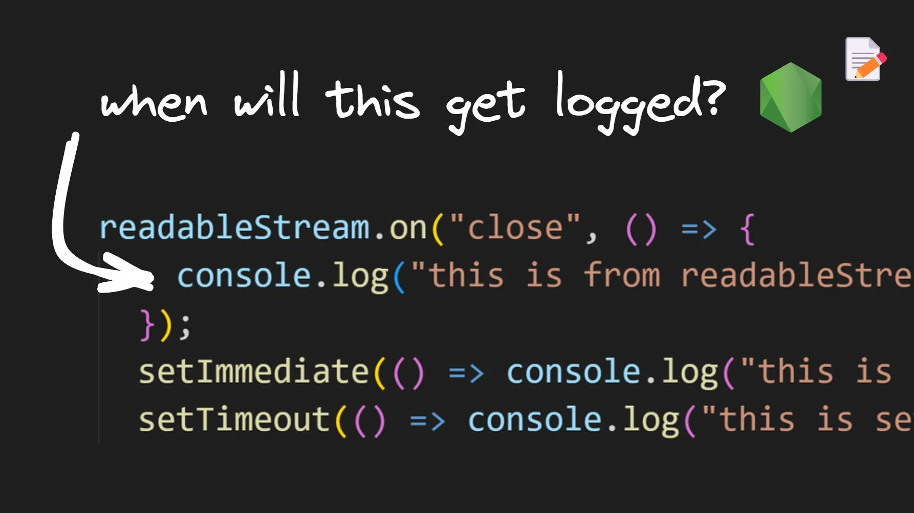
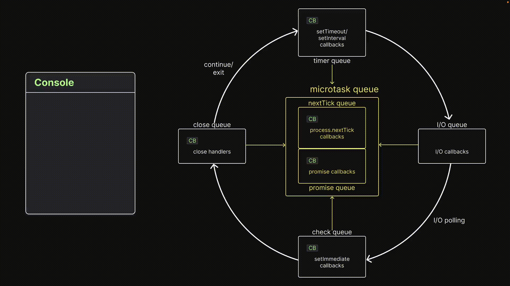

# Visualizing the Close Queue in the Node.js Event Loop



## **Enqueueing callback functions**

Before we examine our final experiment in this series, I want to point out that the close queue contains callbacks associated with the close event of an asynchronous task. Here's an example of adding a callback function to the `close` queue:

```node
readableStream.on("close", () => {
  console.log("this is from readableStream close event callback");
});
```

## **Experiment 14**

### **Code**

```node
// index.js
const fs = require("fs");

const readableStream = fs.createReadStream(__filename);
readableStream.close();

readableStream.on("close", () => {
  console.log("this is from readableStream close event callback");
});
setImmediate(() => console.log("this is setImmediate 1"));
setTimeout(() => console.log("this is setTimeout 1"), 0);
Promise.resolve().then(() => console.log("this is Promise.resolve 1"));
process.nextTick(() => console.log("this is process.nextTick 1"));
```

First, we import the `fs` module. Then, we create a readable stream using `fs.createReadStream()`. Afterward, we close the stream using the `close()` method. We listen to the `close` event, which is emitted when the stream is closed, and add a listener to log "this is from the readableStream close event callback".

After this, we have a few familiar methods: `setImmediate()`, `setTimeout()`, `Promise.resolve().then()`, and `process.nextTick()`.

### Visualization



After the call stack executes all statements, there will be one callback in each queue except the I/O queue. When there is no further code to execute, control enters the event loop.

First, the callback in the `nextTick` queue is dequeued and executed. Then, the callback in the promise queue is dequeued and executed, followed by the timer queue callback.

Next, the event loop moves on to the check queue and dequeues and executes its callback. Finally, control moves on to the close queue, where the final callback is dequeued and executed.

### **Inference**

> **Close queue callbacks are executed after all other queue callbacks in a given iteration of the event loop.**
> 

## **Conclusion**

The event loop is a C program that coordinates the execution of synchronous and asynchronous code in Node.js. It manages six different queues: `nextTick`, promise, timer, I/O, check, and close.

To add a task to the nextTick queue, we use the `process.nextTick()` method. To add a task to the promise queue, we resolve or reject a promise. To add a task to the timer queue, we use `setTimeout()` or `setInterval()`.

To add a task to the I/O queue, we execute an async method. To add a task to the check queue, we use the `setImmediate()` function. Finally, to add a task to the `close` queue, we attach close event listeners.

The order of execution follows the same order listed here. However, it's important to note that the nextTick and promise queues are executed in between each queue and also in between each callback execution in the timer and check queues.

[credits]: 

- [https://www.builder.io/blog/visualizing-nodejs-close-queue](https://www.builder.io/blog/visualizing-nodejs-close-queue)