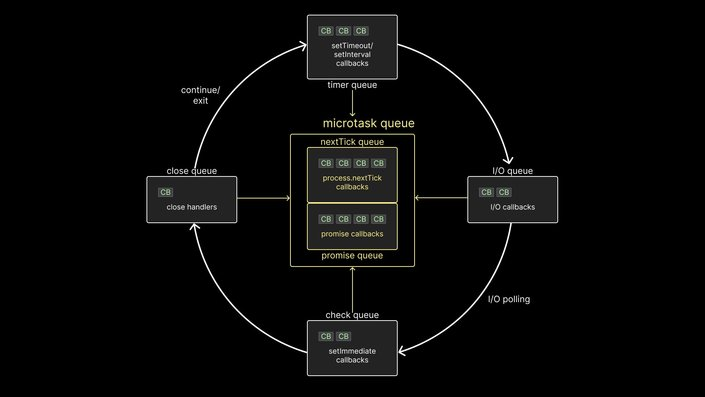

# Deep Diving into Node.js Event Loop

## **Libuv and asynchronous operations**

It is pretty clear from earlier section that libuv helps handle asynchronous operations in Node.js. For async operations like handling a network request, libuv relies on the operating system primitives. For async operations like reading a file that has no native OS support, libuv relies on its thread pool to ensure that the main thread is not blocked. However, that does inspire a few questions.

- When an async task completes in libuv, at what point does Node decide to run the associated callback function on the call stack?
- Does Node wait for the call stack to be empty before running the callback function, or does it interrupt the normal flow of execution to run the callback function?
- What about other async methods like setTimeout and setInterval, which also delay the execution of a callback function?
- If two async tasks such as setTimeout and readFile complete at the same time, how does Node decide which callback function to run first on the call stack? Does one get priority over the other?

All of these questions can be answered by understanding the core part of libuv, which is the event loop.

## **What is the event loop?**

Technically, the event loop is just a C program. But, you can think of it as a design pattern that orchestrates or coordinates the execution of synchronous and asynchronous code in Node.js.

### **Visualizing the event loop**

The event loop is a loop that runs as long as your Node.js application is up and running. There are six different queues in every loop, each holding one or more callback functions that need to be executed on the call stack eventually.

- First, there is the timer queue (technically a min-heap), which holds callbacks associated with setTimeout and setInterval.
- Second, there is the I/O queue which contains callbacks associated with all the async methods such as methods associated with the `fs` and `http` modules.
- Third, there is the check queue which holds callbacks associated with the setImmediate function, which is specific to Node.
- Fourth, there is the close queue which holds callbacks associated with the close event of an async task.

Finally, there is the microtask queue which contains two separate queues.

- nextTick queue which holds callbacks associated with the process.nextTick function.
- Promise queue which holds callbacks associated with the native Promise in JavaScript.

It is important to note that the timer, I/O, check, and close queues are all part of libuv. The two microtask queues, however, are not part of libuv. Nevertheless, they are still part of the Node runtime and play an important role in the order of execution of callbacks. Speaking of which, let's understand that next.

### **How the event loop works**

The arrowheads are already a giveaway, but it's easy to get confused. Let me explain the priority order of the queues. First, know that all user-written synchronous JavaScript code takes priority over async code that the runtime would like to execute. This means that only after the call stack is empty does the event loop come into play.

Within the event loop, the sequence of execution follows certain rules. There are quite a few rules to wrap your head around, so let's go over them one at a time:

1. Any callbacks in the microtask queue are executed. First, tasks in the nextTick queue and only then tasks in the promise queue.
2. All callbacks within the timer queue are executed.
3. Callbacks in the microtask queue (if present) are executed after every callback in the timer queue. First, tasks in the nextTick queue, and then tasks in the promise queue.
4. All callbacks within the I/O queue are executed.
5. Callbacks in the microtask queues (if present) are executed, starting with nextTickQueue and then Promise queue.
6. All callbacks in the check queue are executed.
7. Callbacks in the microtask queues (if present) are executed after every callback in the check queue. First, tasks in the nextTick queue, and then tasks in the promise queue.
8. All callbacks in the close queue are executed.
9. For one final time in the same loop, the microtask queues are executed. First, tasks in the nextTick queue, and then tasks in the promise queue.

If there are more callbacks to be processed at this point, the loop is kept alive for one more run, and the same steps are repeated. On the other hand, if all callbacks are executed and there is no more code to process, the event loop exits.

This is the role that libuv's event loop plays in the execution of asynchronous code in Node.js. With these rules in mind, we can revisit the questions from earlier.

> **Q. When an async task completes in libuv, at what point does Node decide to run the associated callback function on the call stack?**
> **Answer:** Callback functions are executed only when the call stack is empty.

> **Q. Does Node wait for the call stack to be empty before running the callback function, or does it interrupt the normal flow of execution to run the callback function?**
> **Answer:** The normal flow of execution will not be interrupted to run a callback function.

> **Q. What about other async methods like setTimeout and setInterval, which also delay the execution of a callback function?**
> **Answer:** setTimeout and setInterval callbacks are given first priority.

> **Q. If two async tasks such as setTimeout and readFile complete at the same time, how does Node decide which callback function to run first on the call stack? Does one get priority over the other?**
> **Answer:** Timer callbacks are executed before I/O callbacks, even if both are ready at the exact same time.
> 

There was a lot more we learned but this visual representation below (which is the same as above) is what I would like you to imprint in your mind as it shows how Node.js executes asynchronous code under the hood.

"But wait, where's the code that verifies this visualization?" you may ask. Well, each queue in the event loop has nuances in execution, so it's optimal to deal with them one at a time. In this section, we would be dealing with each queue in detail.

## **Conclusion**

The event loop is a fundamental part of Node.js that enables asynchronous programming by ensuring the main thread is not blocked. Understanding how the event loop works can be challenging, but it is essential for building performant applications.

This visual guide has covered the basics of asynchronous programming in JavaScript, the Node.js runtime, and libuv, which is responsible for handling asynchronous operations. With this knowledge, you can build a strong mental model of the event loop, which will help you write code that takes advantage of Node.js' asynchronous nature.

[credits]:

- [https://www.builder.io/blog/visual-guide-to-nodejs-event-loop#how-the-event-loop-works](https://www.builder.io/blog/visual-guide-to-nodejs-event-loop#how-the-event-loop-works)