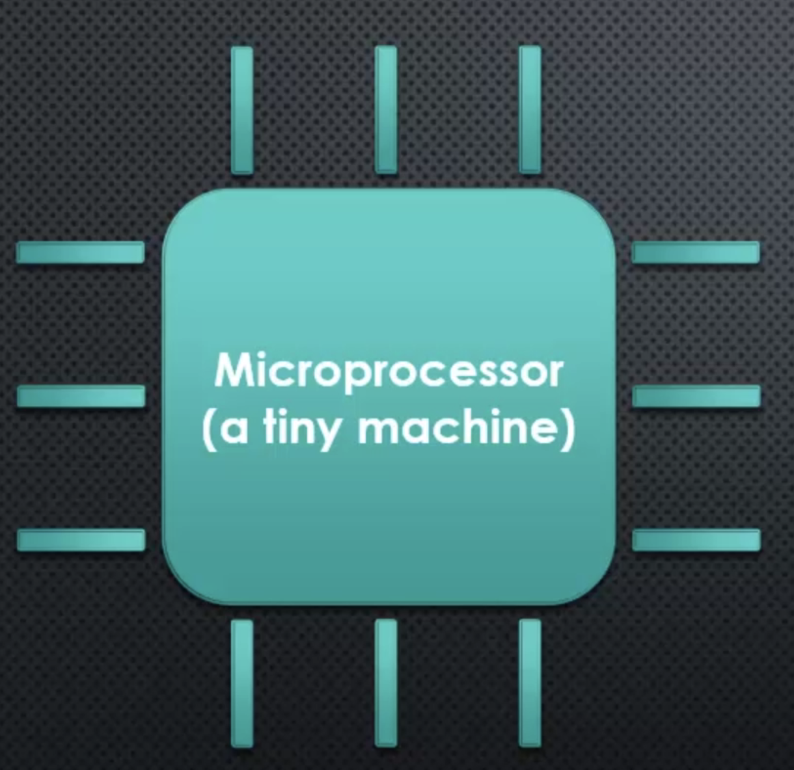
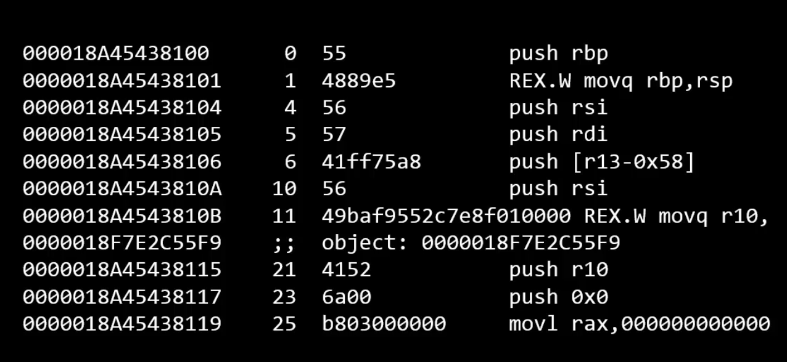
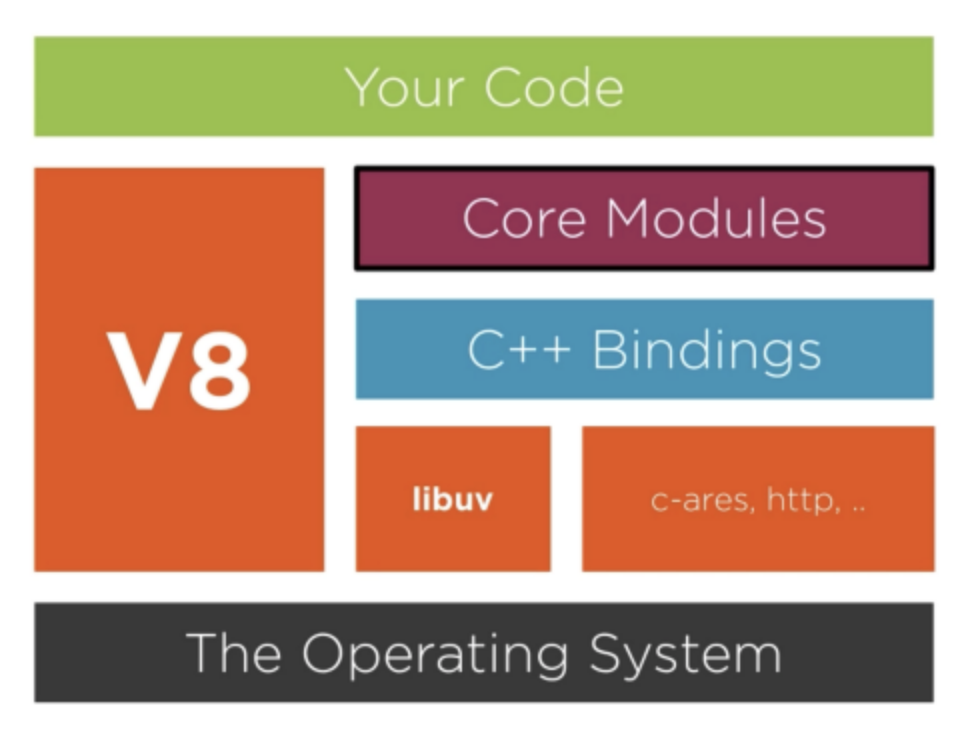

# NodeJs : an Overview ✨

Node.js is an open-source, server-side JavaScript runtime environment built on Chrome's V8 JavaScript engine. It allows you to run JavaScript code outside of a web browser, making it a popular choice for building scalable network applications and web servers.

**Some key features of Node.js include:**

- 🚀 **Asynchronous and Event-driven:** Node.js uses an event-driven, non-blocking I/O model, which makes it efficient and lightweight. It can handle a large number of concurrent connections without blocking the execution of other operations. 
- 🌐 **Web Development:** Node.js has a vast ecosystem of modules and packages that enable developers to build web applications easily. It provides frameworks like Express.js, which simplifies the process of building web servers and APIs. 
- 💡**JavaScript Everywhere:** Node.js allows developers to use JavaScript on both the server-side and client-side, making it easier to share code and logic between the front-end and back-end of an application.

Hold up! 😮 These are a hell lot of terms to begin with!! 🤯

So let's start from the very beginning 🌟🚀.

## Processors, Machine Language, and C++

In order to have a proper mental model of NodeJs, we first have to have an accurate understanding of it's core - The thing at the heart of nodejs - **The V8 Javascript Engine**.

To begin with, we need to understand Processors, Machine Code and C++... and before you say "Hey!! I'm here to learn about Nodejs and writing javascript", well, just hang with me.

So, first of all, let's talk about the thing that's sitting inside your computer right now as you're reading this documentation, and that's your **microprocessor**.

- A processor, in very layman terms is a machine with very small parts that work in andem with electrical inputs and ultimately do a job. 
- We give the microprocessor instructions. Now, not all microprocessors are the same. In fact, they don't all speak the exact same language.
- When we give a microprocessor some instructions, it has to be given in some language that it understands.
- There are variety of sets of instructions, or languages that microprocessors may be designed to speak. Some of these lanuages are : 
  - IA-32
  - x86-64
  - ARM
  - MIPS
- So basically, a microprocessor is a machine that accepts a certain set of instructions and carries them out, and these instructions (which can be in variety of languages, and the microprocessor will speak in one of them) is computer code, which we are giving directly to machine, called as **Machine Code**.
- **Machine Code (Language):** Programming Languages spoken by Computer Processors. Every program that runs on your computer eventually is converted to (compiled to) Machine Code, and then run by the Processor. 
  An example machine code:
  

As machine code varies from processor to processor, very difficult to understand and write, we write code in laguages that are converted or compiled into machine code.

So as time passed by, we built more and more languages on top of other and eventually got abstracted very far away from the processor. We moved from Machine Code to **Assembly language** which was still pretty close to machine, to **C & C++**, a high level language which still do have a high degree of control of things, to **Javascript** a very very high level language very far from machine and we don't have to directly deal with memory and all.

Pretty interesting right 💫, how we moved from as low as machine code to very very far from machine to Javascript. So now let's dive into **Nodejs**, and specifically **Chrome V8 Engine**🚀.

## Nodejs and V8

### Node is written in C++

From a long time Javascript have been a browser based language, every browser have their own javascript engines (spidermonkey in firefox, V8 in chrome).

As Js was invented, and different browsers had their different js engines, with some changes and tweaks, it needed a standard to maintain the consistency and thus **ECMASCRIPT** was found which is a standard organization for JS.

**Javascript Engines** are basically softwares (or computer programs) which converts Javascript code into something the computer processor can understand. Each Javascript Engine have to follow the ECMASCRIPT standard on how the language should work and what features it should have.

Among many JS Engines out there, V8 (built by google) is by far the most popular and most used Javascript Engine, and Nodejs is built on top of it.

### V8

Google's V8 engine is open source, available to look at and to even change for your own purposes 😲.

V8 was primary written to be used inside google chrome browser, however, it's also built in a way that's let it be used elsewhere and in other ways. 

V8 is built in a way that it can run standalone , or can also be embedded into any C++ application (by including V8 as a module) 😵, and that's exactly how the journey to the Nodejs started 🌟.

So basically what Node did was, took V8 engine, embedded into it's own C++ program, and added a lot more functionalities to Js, which Js by itself was not cpable to.
Nodejs took Javascript outside the browser, and by the use of C++ made it possible for JS to run inside a computer, interacting directly with OS ✨. 

### The Node Core

The Node is built up on following elements :
- V8
- Libuv
- http-parser
- c-ares
- OpenSSL
- zlib

With that said, we can split Node.js into two parts: **V8** and **Libuv**. V8 is about 70% C++ and 30% JavaScript, while Libuv is completely written in C++.

Nodejs have basically 2 cores: the **C++ core** and the **Javascript Core**

**The C++ core** consists of nodejs core modules, V8, Libuv, and other C++ libraries and dependencies.

**The Javascript Core :** There is a plenty of C++ utilities within Nodejs, however, there is actually pure javascript just been written for you to help making using those C++ features easier, as well as also some other common tasks and needs that you commonly have in javascript development.

Most of this JS core is just wrappers for the C++ features, also called **C++ bindings**, written for you so that you don't have to write these bindings yourselves when using these C++ features in your code.
While the other portion of the JS core is the utility functions, things which you could have written yourself, but is made available to make your life as a nodejs developer easier 😃🌟.
