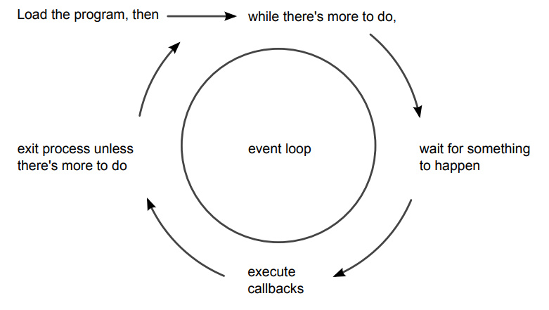

# Basics of Node Js

In this repo, I am covering the complete basics of node.js including core modules, and fundamentals like streams and buffer.

## How Node.js Applications work

Node.js couples JavaScript with an event loop for quickly dispatching operations when events occur. Many JavaScript environments use an event loop, but it is a core feature of Node.js.
 

Node.js’s philosophy is to give you low-level access to the event loop and to system resources. Or, in the words of core committer Felix Geisendörfer, in Node.js “everything runs in parallel except your code.”
 

If this seems a little backward to you, don’t worry. The following figure showshow the event loop works.

As long as there’s something left to do, Node.js’s event loop will keep spinning. Whenever an event occurs, Node.js invokes any callbacks (event handlers) that are listening for that event.
 

As a Node.js developer, your job is to create the callback functions that get executed in response to events. Any number of callbacks can respond to any event, but only one callback function will ever be executing at any time.
 

Everything else your program might do—like waiting for data from a file or an incoming HTTP request—is handled by Node.js, in parallel, behind the scenes. Your application code will never be executed at the same time as anything else. It will always have the full attention of Node.js’s JavaScript engine while it’s running.

## Single - Threaded and Highly Parallel

Other systems try to gain parallelism by running lots of code at the same time, typically by spawning many threads. But not Node.js. As far as your JavaScript code is concerned, Node.js is a single-threaded environment. At most, only one line of your code will ever be executing at any time.
 

Node.js gets away with this by doing most I/O tasks using nonblocking
techniques. Rather than waiting line-by-line for an operation to finish, you create a callback function that will be invoked when the operation eventually succeeds or fails.
 

Your code should do what it needs to do, then quickly hand control back over to the event loop so Node.js can work on something else.
